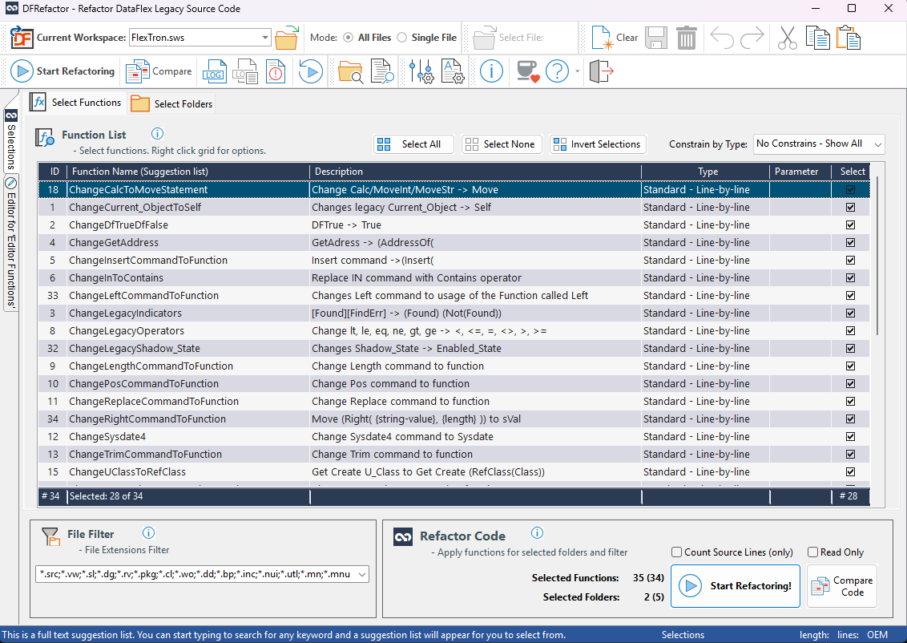
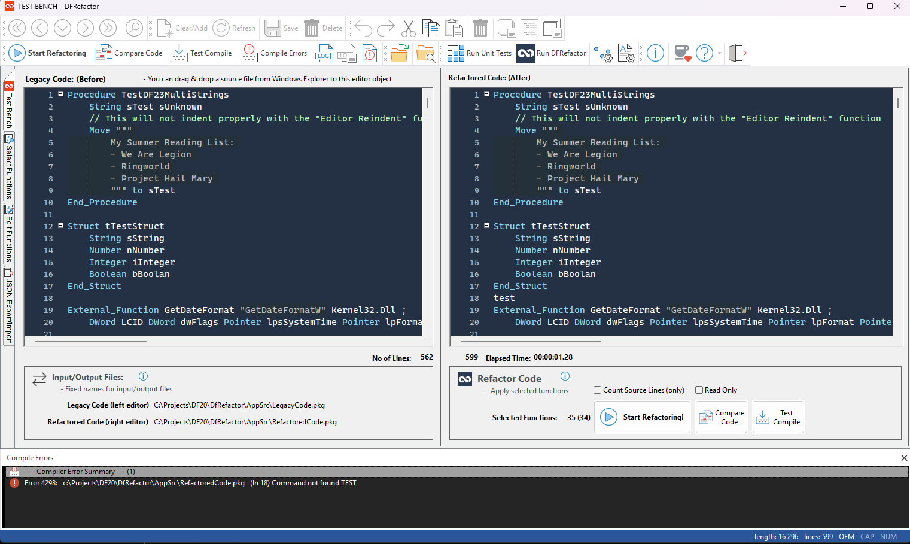

# DFRefactor - An Automated Refactoring Tool for DataFlex

It is highly recommended to download and install the GitHub Desktop app, as it will significantly simplify your work. You can download it via this link: https://desktop.github.com/download/.

Once installed, click the "<> Code" button at this GitHub page and select "Open with GitHub Desktop." This will install the complete repository in your chosen download location. 

**Note:** Do not select "Download ZIP," as GitHub will not include the libraries used by the workspace, and you would need to download them manually, which can be cumbersome!

DFRefactor is a powerful and free tool written in DataFlex that assists with refactoring legacy DataFlex code. It specifically targets code that uses syntax that is no longer supported or recommended. Refactoring is the process of improving the structure and readability of existing code without altering its external behavior.

The only supported versions of DataFlex Studio are the latest two: currently, DataFlex 2024 and 2025. While this means you need one of these two versions installed to compile and run the refactoring programs, it does not prevent you from using the tool on projects or workspaces created with earlier versions of DataFlex. An older version of the tool, compatible with versions prior to 2023, is available as a separate branch. However, please note that this branch is not maintained, so you would need to use it at your own risk.

To refactor source code with DFRefactor, simply select the desired functions and click "Start Refactoring" for the chosen workspace.

New refactoring functions should be added to the main function repository contained within the `oRefactorFuncLib.pkg` object. Additionally, functions must be registered using the meta-tag `{ Published = True }` above the function declaration. Other meta-tags are also required, so please follow the instructions at the top of the function library object file.

There are various types of refactoring functions, and the source code is generally processed line by line. Every refactoring function must have the interface of "String ByRef sLine" and an additional optional parameter "String sParameter." It should also return a Boolean value of True if the supplied source line was changed.

The workspace consists of three important programs:
- **TestBench.src**: A test bench used for developing and testing your custom refactoring functions.
- **DFUnit_Testrunner.src**: A series of unit tests. You will need to add several unit tests for each new refactoring function included in the function repository.
- **DFRefactor.src**: The main refactoring program that can be utilized once all functions have been tested and confirmed to work as intended.

To use DFRefactor, you will need DataFlex Studio version 24.0 or later.

