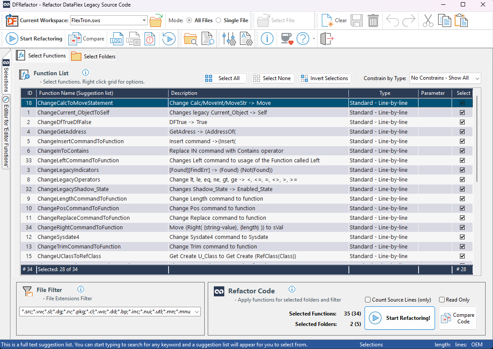
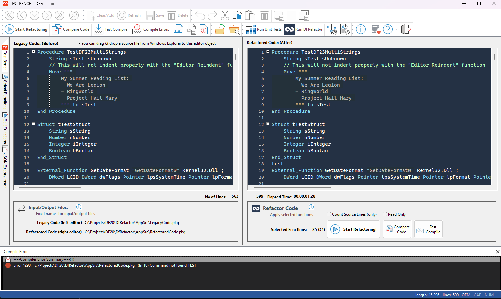

# DFRefactor - An Automated Refactoring Tool for DataFlex

**Inspired by Martin Fowler's *Refactoring: Improving the Design of Existing Code* (2019 - Second Edition).**

## What is this?

DFRefactor is an open-source, automated refactoring tool for **DataFlex** — a business application language dating to the 1980s, still in active commercial use today. The tool implements both **canonical refactorings from Fowler's book** (Remove Dead Code, Replace Class, the spirit of Decompose Conditional) and **DataFlex-specific transformations** for legacy syntax that no general-purpose IDE would know how to modernize — like the 1980s square-bracket `[Found]` indicators, which the tool mechanically rewrites into modern expressions.

## Demo

A short video walkthrough (4 minutes): **[YouTube URL — to be added once recorded]**

---

## Installation and use

It is highly recommended to download and install the GitHub Desktop app, as it will significantly simplify your work. You can download it via this link: https://desktop.github.com/download/.

Once installed use **the Edge browser**, click the "<> Code" button at this GitHub page and select "Open with GitHub Desktop." This will install the complete repository in your chosen download location. 

**An alternate approach** is to copy the address from the browser for the DFRefactor GitHub page, aka;
https://github.com/NilsSve/DfRefactor

Then from GitHub Desktop, select "File - Clone a repostory", then select  the third tab-page "URL",
and paste the path from above. Finally select your local path to install to, and click the "Clone" button.

**Note:** Do not select "Download ZIP," as GitHub will not include the libraries used by the workspace, and you would need to download them manually, which can be cumbersome!

DFRefactor is a powerful and free tool written in DataFlex that assists with refactoring legacy DataFlex code. It specifically targets code that uses syntax that is no longer supported or recommended. Refactoring is the process of improving the structure and readability of existing code without altering its external behavior.

The only supported versions of DataFlex Studio are the latest two: currently, DataFlex 2024 and 2025. While this means you need one of these two versions installed to compile and run the refactoring programs, it does not prevent you from using the tool on projects or workspaces created with earlier versions of DataFlex. An older version of the tool, compatible with versions prior to 2023, is available as a separate branch. However, please note that this branch is not maintained, so you would need to use it at your own risk.

To refactor source code with DFRefactor, simply select the desired functions and click "Start Refactoring" for the chosen workspace.

New refactoring functions should be added to the main function repository contained within the `oRefactorFuncLib.pkg` object. Additionally, functions must be registered using the meta-tag `{ Published = True }` above the function declaration. Other meta-tags are also required, so please follow the instructions at the top of the function library object file.

There are various types of refactoring functions, and the source code is generally processed line by line. Every refactoring function must have the interface of "String ByRef sLine" and an additional optional parameter "String sParameter." It should also return a Boolean value of True if the supplied source line was changed.

The workspace consists of three important programs:
- **TestBench.src**: A test bench used for developing and testing your custom refactoring functions.
- **DFUnit_Testrunner.src**: A series of unit tests. You will need to add several unit tests for each new refactoring function included in the function repository.
- **DFRefactor.src**: The main refactoring program that can be utilized once all functions have been tested and confirmed to work as intended.

To use DFRefactor, you will need DataFlex Studio version 24.0 or later.





---

## Command-line and batch mode

Both `DFRefactor.exe` and `DFUnit_TestRunner.exe` can run unattended from the command line, which makes them usable in scripts and CI pipelines.

### DFRefactor

Run a saved configuration (recommended):

```
DFRefactor.exe /c "DFRefactorCmdLineWS.ini"
```

The ini-file holds the workspace, folders, file filter, and the selected functions. Generate one from **Program Settings → Export to ini-file** rather than writing it by hand. The `/c` flag implies batch mode.

Or pass explicit flags instead of an ini-file:

```
DFRefactor.exe /sws "C:\Proj\My.sws" /d AppSrc;DDSrc /batch
```

Common flags:

| Flag(s) | Value | Meaning |
|---|---|---|
| `/h` `/help` `/?` | — | Show parameter help, then exit |
| `/debug` | — | Echo all passed parameters, then exit |
| `/sws` | `"file.sws"` | Workspace file (mandatory unless `/c` is used) |
| `/f` `/file` | `"file"` | Single source file (takes precedence over `/sws`) |
| `/d` `/dirs` `/folders` | `A;B;C` | Semicolon-separated folders, added to the workspace's saved folders |
| `/b` `/batch` | — | Run automatically and silently (UI visible, no interaction) |
| `/c` `-c` `--console` | `"file.ini"` | Use an ini-file; forces batch mode on |

Flag and value are a space-separated pair; flags may appear in any order; paths must be quoted; flag spelling is case-insensitive. Run `DFRefactor.exe /help` for the authoritative list, or see the **Command-Line Usage** help topic.

### DFUnit_TestRunner

Run the unit tests headless (for CI):

```
DFUnit_TestRunner.exe -c
```

Writes results to the console and exits `0` if all tests pass or `-1` on any failure. Without `-c` (or `--console`) the runner starts in UI mode.

> Note: `-c` / `--console` means *use a config ini-file* for `DFRefactor.exe`, but *console / CI mode* for `DFUnit_TestRunner.exe`. They are different programs with different argument handling.
